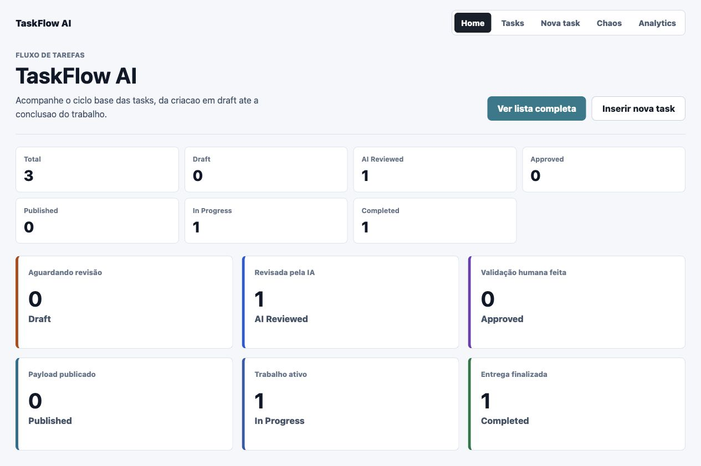
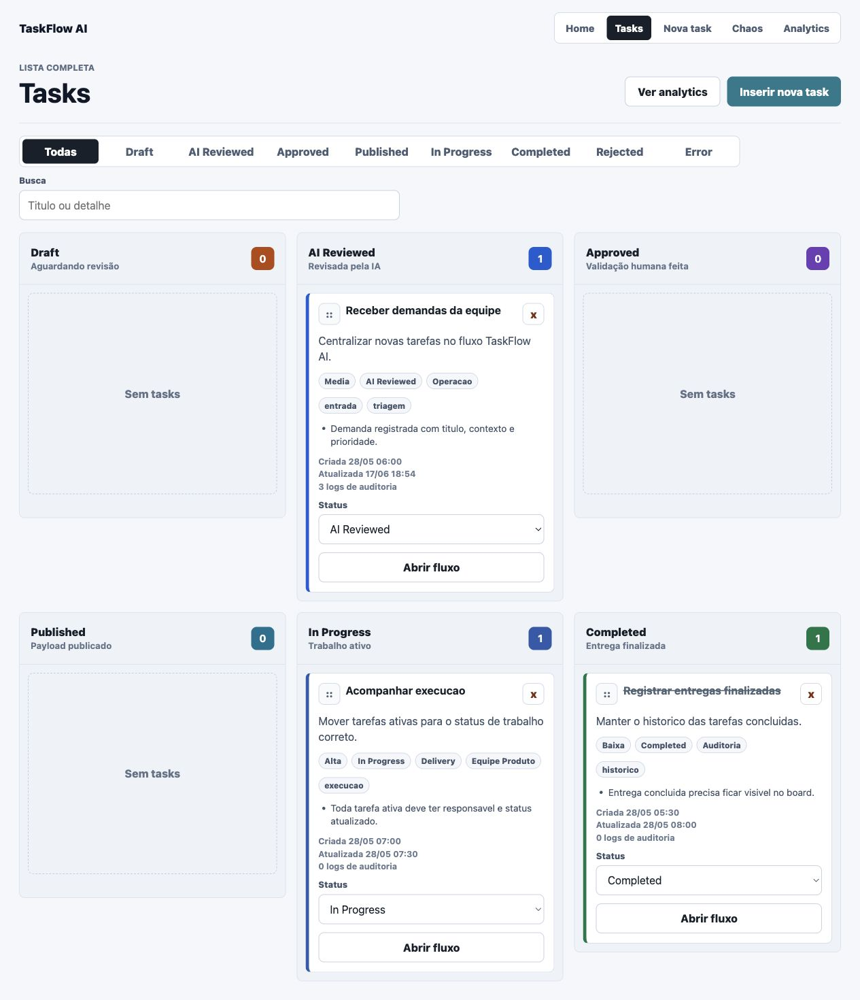
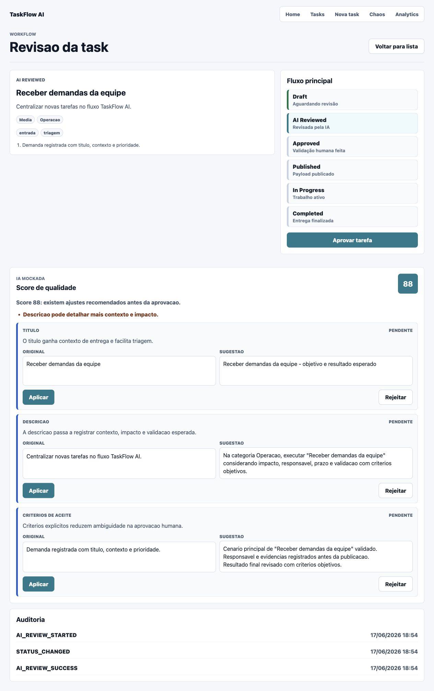
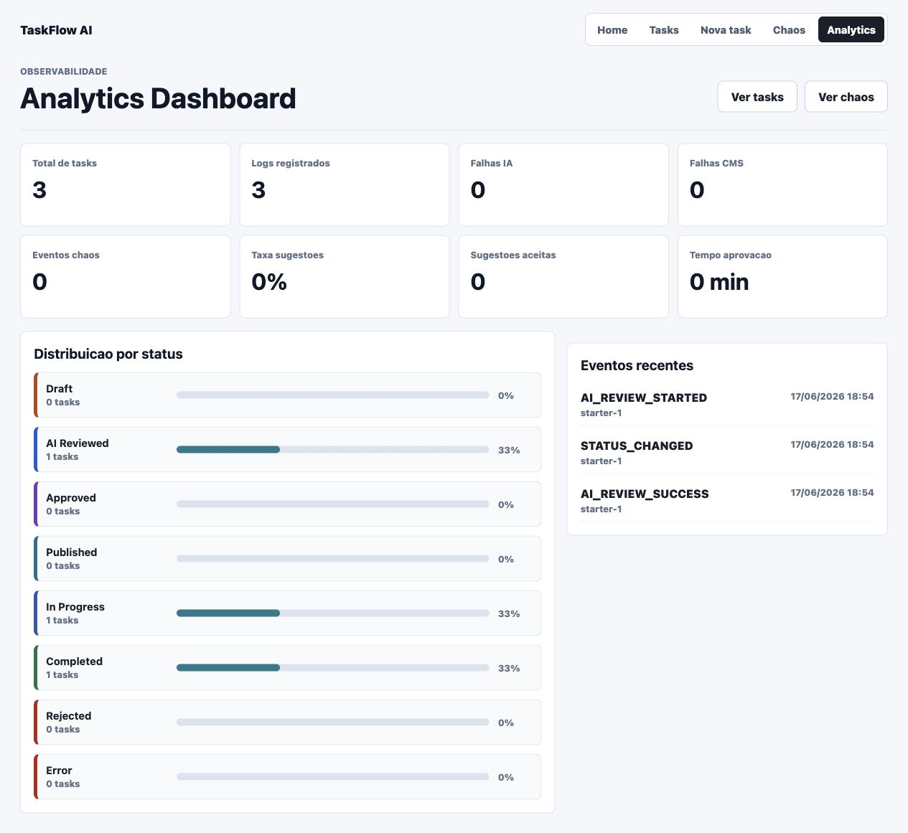

# TaskFlow AI

TaskFlow AI e um task manager inteligente construido em Angular para demonstrar um fluxo enterprise de tarefas com revisao assistida por IA, aprovacao humana, geracao de payload, simulacao de CMS, observabilidade e chaos engineering.

O projeto nasceu como `cms-ai-portal`, mas foi reestruturado em fases para virar uma plataforma de estudo e portfolio tecnico.

## Screenshots

As imagens abaixo sao geradas a partir do app local durante a fase final de polimento.

| Home                               | Kanban                                       |
| ---------------------------------- | -------------------------------------------- |
|  |  |

| Review                                      | Analytics                                    |
| ------------------------------------------- | -------------------------------------------- |
|  |  |

## Funcionalidades

- Criacao de tasks enriquecidas com prioridade, categoria, tags, responsavel, prazo e criterios de aceite.
- Persistencia local em `localStorage`, incluindo migracao de dados legados.
- Workflow principal: `Draft -> AI Reviewed -> Approved -> Published -> In Progress -> Completed`.
- Revisao mockada por IA com sugestoes, score de qualidade e alertas.
- Aplicacao ou rejeicao individual de sugestoes.
- Aprovacao humana e geracao de payload JSON.
- Simulacao de envio para CMS/backend com sucesso e falhas controladas.
- Chaos Dashboard para ativar cenarios de falha de IA, CMS e rede.
- Analytics Dashboard com metricas de status, falhas, sugestoes e tempo ate aprovacao.
- Kanban com Angular CDK Drag and Drop e audit log de movimentacao.
- Cobertura de testes unitarios em 100%.

## Rotas

| Rota                    | Tela                             |
| ----------------------- | -------------------------------- |
| `/`                     | Home com resumo operacional      |
| `/tasks`                | Board Kanban e filtros           |
| `/tasks/new`            | Criacao de task                  |
| `/tasks/:taskId/review` | Revisao, IA, aprovacao e payload |
| `/chaos`                | Chaos Dashboard                  |
| `/analytics`            | Observabilidade e auditoria      |

## Arquitetura

```txt
src/app/
  core/
    models/
    services/
  features/
    analytics-dashboard/
    chaos-dashboard/
    home/
    task-create/
    task-list/
    task-review/
```

Principais services:

- `TaskService`: estado das tasks, migracao, persistencia, status, Kanban e audit logs.
- `AuditLogService`: criacao padronizada de logs.
- `AiReviewService`: simulacao de revisao por IA.
- `TaskWorkflowService`: orquestracao do fluxo de negocio.
- `TaskPayloadBuilderService`: criacao do payload final.
- `CmsService`: simulacao de backend/CMS.
- `ChaosService`: flags e logs dos cenarios de caos.
- `AnalyticsService`: metricas consolidadas.

## Modelo de workflow

```txt
Draft
  -> AI Reviewed
  -> Approved
  -> Published
  -> In Progress
  -> Completed
```

Status auxiliares:

- `Rejected`
- `Error`

## Comandos

Instalar dependencias:

```bash
npm install
```

Rodar em desenvolvimento:

```bash
npm run start
```

Validar TypeScript dos testes:

```bash
npx tsc -p tsconfig.spec.json --noEmit
```

Rodar testes com cobertura:

```bash
npm run test:coverage
```

Gerar build:

```bash
npm run build
```

## Qualidade

O projeto usa a configuracao de testes do Angular com Vitest e thresholds de cobertura por arquivo:

- Statements: 100%
- Branches: 100%
- Functions: 100%
- Lines: 100%

## Roadmap executado

- Fase 1: base arquitetural e modelos enterprise.
- Fase 2: workflow principal.
- Fase 3: IA mockada.
- Fase 4: chaos engineering.
- Fase 5: observabilidade.
- Fase 6: Kanban com drag and drop.
- Fase 7: acabamento de UX, documentacao e preparacao para portfolio.

## Decisoes tecnicas

- `localStorage` e a persistencia oficial nesta versao.
- IA, CMS e chaos sao mockados para manter o projeto autocontido.
- Angular CDK e usado apenas onde ha ganho real de interacao: Kanban drag and drop.
- A aplicacao prioriza componentes standalone e services pequenos.
- A UI segue uma linguagem operacional, focada em leitura rapida, status e acoes recorrentes.
